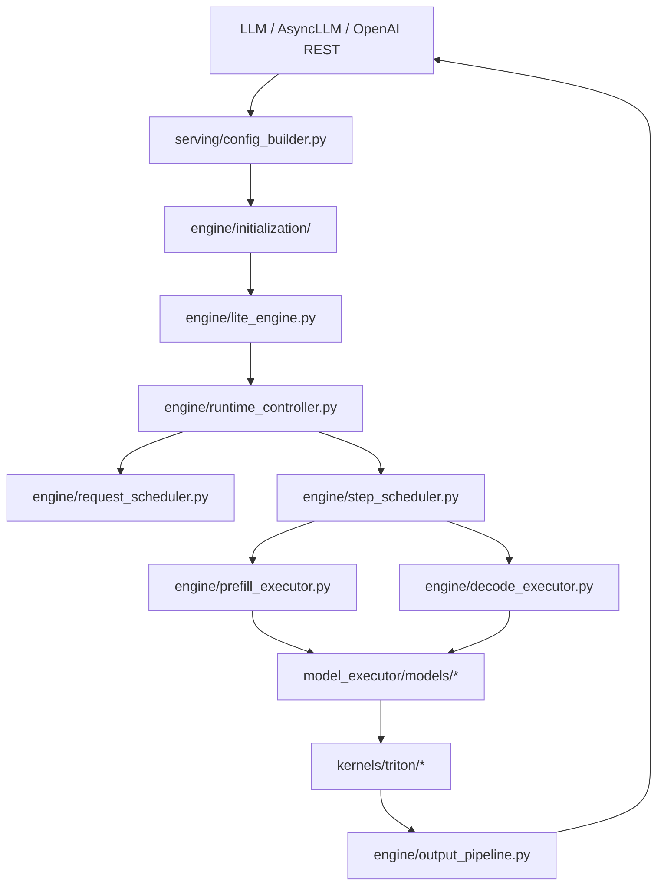
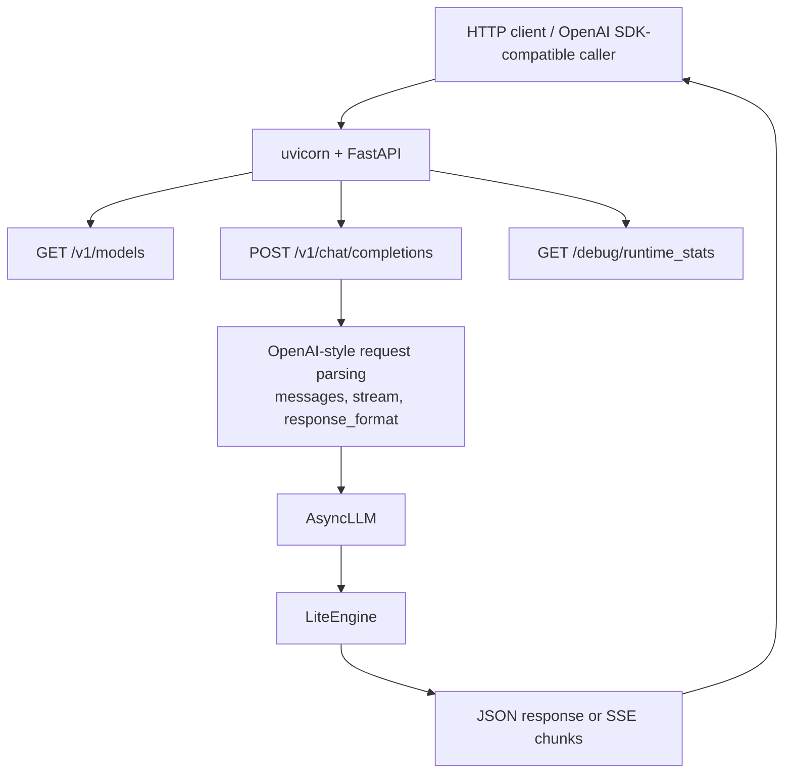
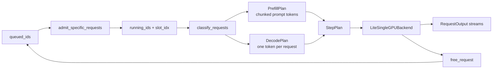
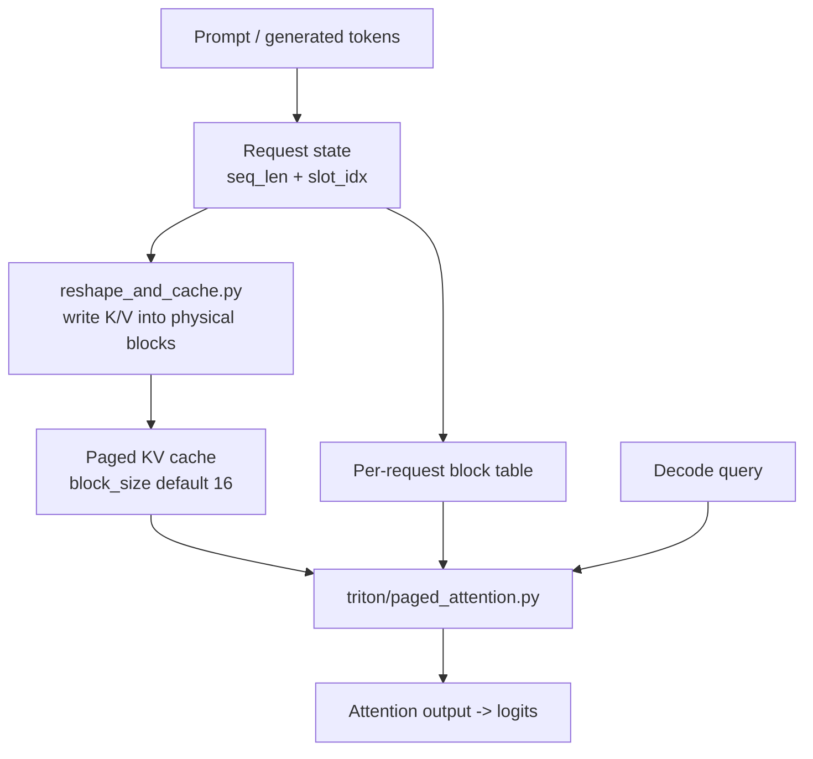

# FastInference Lite Architecture

FastInference is a lite-only, single-GPU inference runtime. It keeps the
high-performance serving path from the vLLM-derived codebase while narrowing
the maintained architecture to pure Python plus Triton.

For feature and model status, use [CAPABILITY_MATRIX.md](CAPABILITY_MATRIX.md)
as the source of truth.

## Runtime Path

```text
LLM / AsyncLLM / OpenAI API Server
  -> vllm/serving/config_builder.py  # model/config assembly
  -> vllm/engine/initialization/     # startup allocators and runtime assembly
  -> vllm/engine/lite_engine.py      # orchestration
  -> vllm/engine/async_driver.py     # background worker thread for engine steps
  -> vllm/engine/step_scheduler.py   # step budget and batch selection
     -> vllm/engine/planners/        # admission and budget computation
  -> vllm/engine/request_scheduler.py
  -> vllm/engine/prefill_executor.py
  -> vllm/engine/decode_executor.py
  -> vllm/engine/sampling_driver.py  # delegates to vllm/engine/sampling/
  -> vllm/engine/output_pipeline.py
```

`LiteEngine` is the official execution path for both offline and async/server
use. Legacy upstream concepts such as workers, block managers, and distributed
executors are not a second supported runtime.

Model-specific direct runtimes are owned by adapters. `LiteEngine` may install
an adapter-provided direct runtime, but generic engine code should not branch on
model class names.



## Engine Initialization

`LiteEngine.__init__` delegates startup work to focused initializers in
`vllm/engine/initialization/` so the engine body stays focused on orchestration:

| Module | Responsibility |
| :--- | :--- |
| `kv_cache_allocator.py` | Compute KV cache shapes and allocate the paged K/V pool plus optional TurboQuant scale caches. |
| `memory_auditor.py` | Snapshot CUDA-resident model tensor footprint for startup diagnostics. |
| `runtime_component_factory.py` / `LiteRuntimeAssembler` | Build the runtime component graph consumed by `LiteEngine`. |

These helpers preserve the same dtype, shape, and memory ordering contracts as
the previous inline code; callers such as `KVBlockManager` and the prefill/decode
executors receive identical KV cache tensors regardless of which initializer
produced them.

## Configuration Flow

`vllm/serving/config_builder.py` constructs `VllmConfig`, resolves
`FastInferenceConfig`, then creates `RuntimeConfig`.

```text
FASTINFERENCE_CONFIG / explicit config object
  -> FastInferenceConfig
  -> RuntimeProfileRegistry
  -> RuntimeConfig
  -> engine, scheduler, backend, model metadata
```

Production code should receive policy through `RuntimeConfig` or
`attn_metadata["config"]`. Direct `os.environ` reads in model layers or engine
hot paths are not part of the maintained configuration model.

## Major Boundaries

| Area | Responsibility |
| :--- | :--- |
| `vllm/engine/` | Control plane, scheduling, request lifecycle, runtime stats, errors. |
| `vllm/serving/` | Config assembly for offline and server entrypoints. |
| `vllm/adapters/` | Model capability and policy decisions. |
| `vllm/model_executor/models/` | Maintained lite model implementations, including the split Gemma4 package. |
| `vllm/kernels/triton/` | Maintained hand-written Triton kernels. |
| `vllm/triton_utils/` | Approved Triton import and utility layer. |
| `vllm/entrypoints/openai/` | Maintained HTTP server surface. |

## REST And OpenAI-Compatible APIs

FastInference supports a maintained REST serving path through
`vllm.entrypoints.openai.api_server`. This surface is OpenAI-compatible for the
lite-supported chat subset, but it is not the full upstream OpenAI or vLLM
server API.

Maintained standalone routes:

- `GET /v1/models`
- `POST /v1/chat/completions`
- `GET /debug/runtime_stats`
- `POST /debug/runtime_stats/reset`

`/v1/chat/completions` supports non-streaming JSON responses and streaming
server-sent events. The request parser accepts OpenAI-style `messages`,
`stream`, `max_tokens`, `temperature`, `response_format`, and
`structured_outputs`; text and `image_url` content blocks are accepted for the
current experimental multimodal path.



Compatibility boundaries:

- `POST /tokenize` and `POST /detokenize` are maintained in
  `vllm.entrypoints.serve.tokenize` when that router is attached, but they are
  not part of the standalone OpenAI API server contract above.
- `/v1/responses`, `/v1/completions`, `/v1/embeddings`, pooling, score, rerank,
  and the full upstream OpenAI CLI argument surface are unsupported.

## Scheduling Model

FastInference does not maintain the upstream vLLM worker/block-manager
continuous batching runtime. The lite scheduler implements a smaller
single-process model:

- `AsyncDriver` runs `engine.step()` on a dedicated background worker thread so
  that GPU/ROCm synchronization does not block the asyncio event loop. Results
  are posted back to the event loop with `loop.call_soon_threadsafe`.
- `RequestScheduler` owns running requests, queued requests, stream queues, and
  fixed active slots. It uses set indexes and a deque free-slot pool for O(1)
  membership checks and slot allocation; request iteration order is preserved.
- `RequestState` is the canonical typed request state (slots dataclass) shared
  across scheduler, executors, and output pipeline. Legacy `dict[str, Any]`
  shims have been removed.
- `StepScheduler` builds one `StepPlan` per engine step. Admission, budget, and
  prefill/decode plan assembly are delegated to focused planners in
  `vllm/engine/planners/`: `AdmissionPlanner`, `BudgetComputer`, and
  `DecodePrefillPlanner`. A plan may admit queued requests, run chunked prefills,
  run decodes, or interleave prefill and decode work within configured token and
  fairness limits.
- `StepPlan` carries only execution fields. Observer/debug counters live in
  `StepPlanMetrics` and are consumed by `RuntimeObserver`.
- Single-request decode fast path bypasses adaptive prefill chunk scanning.
  Non-fast decode batches reuse `InputBatchBuilder` scratch tensors for
  `input_ids`, `positions`, `slot_mapping`, and `seq_lens`.
- `SamplingDriver` is now a thin orchestrator: penalties, biases, and masks are
  applied by `vllm/engine/sampling/penalty_encoder.py` (`PenaltyEncoder`), and
  temperature/top-k/top-p/multinomial sampling is performed by
  `vllm/engine/sampling/sampler.py` (`Sampler`). A `FASTINFERENCE_USE_LEGACY_SAMPLING`
  opt-out is routed through `RuntimeConfig`.
- `LiteSingleGPUBackend` executes the plan synchronously on one GPU and frees
  request slots when outputs finish.

This is best described as bounded step-level dynamic batching, not full
upstream continuous batching. New docs and performance claims should avoid the
term "continuous batching" unless the upstream-equivalent runtime contract is
implemented and covered by regression tests.



## Output Text Decoding

`OutputPipeline.finalize_step` no longer eagerly decodes generated token ids to
a string on every step. Instead, `CompletionOutput.text` is a lazy property:
when the output is constructed without an explicit string and a tokenizer is
available, `tokenizer.decode` runs only on first access.

For streaming callers, `.text` is read every step, so decoding still happens per
emitted chunk. For non-streaming callers, intermediate `RequestOutput` objects
are produced but only consumed at finish time; lazy decoding skips the wasted
work for discarded intermediate outputs. Finished outputs are still eagerly
decoded so the final string is cached and cleaned by the configured output
processor.

## Model Layer Shape

Gemma4 is split into focused modules under
`vllm/model_executor/models/gemma4/`:

- `model.py`
- `attention.py`
- `mlp.py`
- `moe.py`
- `layer.py`
- `kv_utils.py`
- `rope.py`
- `config.py`
- `profiling.py`
- `policy_utils.py`

Model-specific policy belongs in `vllm/adapters/` and must not grow new
model-name branches inside the generic engine.

The upstream Transformers modeling backend wrappers are not part of the lite
runtime. New model support should add a focused lite model module plus adapter
policy and loader coverage instead of restoring generic upstream wrappers.

## Attention And Kernels

The maintained decode path uses Triton PagedAttention. Prefill uses the
current hardware-backed SDPA path where appropriate. AWQ decode and Gemma4
paths include specialized Triton kernels for fused QKV, fused gate/up, M=1
GEMV, and selected MoE decode shapes.

PagedAttention is the maintained decode attention path. The request state tracks
logical sequence length and slot assignment; decode kernels read the KV cache
through block tables instead of treating every request as one contiguous KV
tensor. This keeps decode memory access bounded around physical KV blocks and
allows active requests with different sequence lengths to share the same decode
batch shape.



Important constraints:

- Physical KV blocks default to 16 tokens and are controlled by runtime config.
- KV precision is selected by runtime policy (`fp16`, `fp8`, or
  `turbo_int4`), with model adapters allowed to guard unsafe combinations.
- Kernel changes must preserve the block-table contract and include PyTorch
  reference coverage for edge cases such as empty prompts and maximum prompt
  lengths used by regression tests.

Every new Triton kernel must document memory layout and program tiling in ASCII
comments, use `vllm/triton_utils/` for Triton imports, and include correctness
coverage against a PyTorch reference.

## DeepSeek V4 Flash Direct GGUF Path

DeepSeek V4 Flash is an experimental exception to the standard paged-KV model
path. It still enters through `AsyncLLM` and the OpenAI-compatible REST server,
but its adapter installs a direct batch=1 greedy runtime instead of the generic
step scheduler.

```text
OpenAI REST / AsyncLLM
  -> LiteEngine direct_runtime
  -> deepseek_v4_flash/direct_runtime.py
  -> DeepSeekV4FlashForCausalLM.generate_greedy_kernel()
  -> deepseek_v4_flash/gpu_layers.py
  -> kernels/triton/deepseek_v4_flash/*
```

The direct GGUF benchmark reports decode throughput but does not use the
standard per-token streaming observer; `stream_visible=0%` is expected for that
benchmark path.

Current limits are explicit in code and docs:

- batch size is 1; `n > 1` is rejected.
- sampling is greedy only; non-zero temperature, top-p, top-k, and structured
  outputs are rejected for this direct path.
- first-release context is capped at 8192, with default benchmark/correctness
  coverage at 4096.
- this is target-file support for the DS4 Q2/IQ2 GGUF, not generic GGUF model
  loading.

The model-local package owns the heavy work:

| Module | Role |
| :--- | :--- |
| `gguf_reader.py` / `weight_store.py` | Strict mmap reader, semantic tensor binding, raw quantized payload access. |
| `gpu_weight_staging.py` | Bounded UMA/GPU staging, raw Q8 payload staging, expert cache accounting. |
| `gpu_runtime.py` / `compressed_kv.py` | Request-local batch=1 runtime state, raw SWA rows, compressed/indexer KV state. |
| `gpu_layers.py` / `model.py` | Layer orchestration, sliding/compressed attention, MoE routing, output projection. |
| `kernels/triton/deepseek_v4_flash/` | Q8 linear, Q2/IQ2 MoE matvec, attention/cache/output kernels. |

Architecturally, DeepSeek does not use the generic PagedAttention algorithm, but
it keeps the same important memory rule: growing context must not require one
large contiguous KV allocation. Its raw sliding-window rows, compressed rows,
and ratio-4 indexer rows are owned by DeepSeek-specific paged/cache structures.

The current performance work moved the hot path from CPU reference decoding to
GPU execution for Q8 projections, selected IQ2 gate/up, Q2 down experts,
compressed attention, and chunked output projection. The latest kept changes
are deliberately narrow and semantic-preserving:

- selected expert kernels consume direct staged payloads instead of rebuilding
  per-layer payload stacks on the hot path.
- Q8_0 raw kernels sign-extend payload bytes with `uint8 -> int8 -> fp32`,
  avoiding an explicit `raw >= 128` select.
- compressor updates expose nested profile sections for projection, runtime
  copy, norm, pooling, RoPE, FP8 QAT, indexer QAT, and carry work.
- emitted indexer QAT uses a Triton implementation instead of the PyTorch
  reference path.

Rejected performance routes are also part of the architecture record:
graph/capture has been attempted enough times to stop pursuing it; full expert
GPU tables were semantically equivalent but cost too much cold-start time and
memory; Q2 down static unroll and batched Q8 raw matvec did not improve the
measured hot path; compressor dual Q8 projection does not apply to the current
DS4 GGUF because compressor `kv/gate` tensors are F16, not Q8_0. Remaining
bottlenecks are model-local: layer MoE, compressed attention/indexer overhead,
expert staging misses, and Python launch/synchronization cost.

## Compatibility Code

Some upstream-derived packages remain for imports, migration, or experimental
surface. Their existence does not make them official runtime targets:

- `vllm/model_executor/warmup/` may contain compatibility artifacts.
- Multimodal and LoRA runtime hooks are maintained only to the status listed in
  the capability matrix.

The removed upstream runtime directories are `vllm/worker/`, `vllm/core/`, and
`vllm/distributed/`; upstream CLI, pooling, gRPC, executor, spec decode, and
vendored third-party Triton kernel paths have also been removed. P2 cleanup also
removed broken upstream asset helpers, generic multimodal audio/parser helpers,
and Transformers modeling backend wrappers that were outside the lite closure.

## Observability And Errors

- `vllm/engine/runtime_observer.py` records runtime counters for prefix cache,
  fairness, preemption, LoRA, multimodal, and async-driver behavior.
- `vllm/engine/errors.py` centralizes runtime error semantics.
- `GET /debug/runtime_stats` exposes a compact API server summary, and
  `POST /debug/runtime_stats/reset` resets those counters.

## Validation

Use the following gates before claiming broad runtime changes are ready:

```bash
bash tests/run_regression_suite.sh
bash tests/run_inference_correctness_regression.sh
```

For kernel, KV-cache, and numerics changes, also run the relevant model
correctness and performance tools described in `tests/README.md`.
