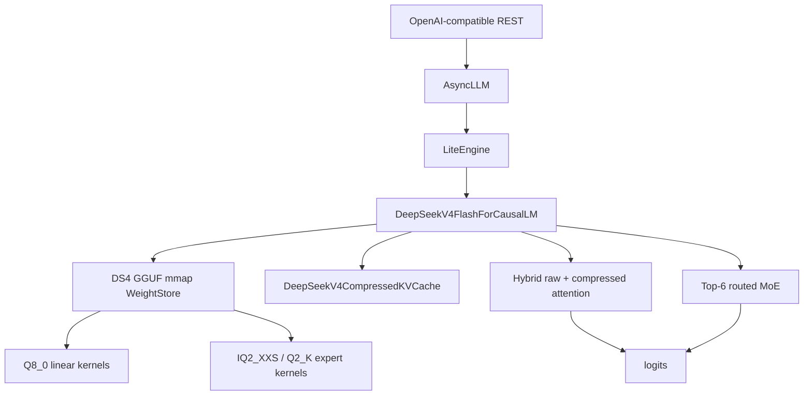

# DeepSeek V4 Flash Q2 Native Support Design

Date: 2026-06-03

## Scope

FastInference will add experimental native support for
`DeepSeek-V4-Flash-Spark-Q2-REAP-ds4.gguf`.

This is not a bridge to an external runtime. FastInference will own model
loading, quantized kernels, compressed KV state, model execution, and REST
serving through the existing lite runtime.

The first release target is intentionally narrow:

- `batch=1`
- `context=4096` and `context=8192`
- greedy decode
- OpenAI-compatible REST callable through `POST /v1/chat/completions`
- no hard throughput target

Out of scope for the first release:

- DeepSeek V4 Pro
- arbitrary DeepSeek GGUF files
- generic GGUF model support
- 1M-token context
- speculative decoding
- distributed execution
- external DS4 server integration
- non-greedy sampling guarantees beyond the existing sampling path

Primary references:

- <https://huggingface.co/0xSero/DeepSeek-V4-Flash-Spark-GGUF>
- <https://github.com/antirez/ds4>
- <https://huggingface.co/docs/transformers/v5.8.0/en/model_doc/deepseek_v4>

## Current Project Fit

The existing lite architecture has the right high-level extension points:

- `vllm/adapters/` owns model capability and runtime policy.
- `vllm/model_executor/models/registry.py` owns model class resolution.
- `vllm/model_executor/models/` owns model implementations.
- `vllm/kernels/triton/` owns custom kernels.
- `vllm/engine/` should remain model-family agnostic.
- `vllm/entrypoints/openai/api_server.py` already serves the lite engine over
  OpenAI-compatible chat REST.

The current PagedAttention path is not a fit for DeepSeek V4 Flash. DeepSeek V4
uses raw sliding-window attention plus compressed attention rows and, in ratio-4
layers, an indexer that selects visible compressed rows. The DeepSeek V4 Flash
model must therefore own a separate compressed KV implementation instead of
pretending to be a standard paged-KV model.

## Proposed Modules

```text
vllm/adapters/deepseek_v4_flash.py
vllm/model_executor/models/deepseek_v4_flash/
  __init__.py
  config.py
  gguf_reader.py
  weight_store.py
  quant.py
  compressed_kv.py
  attention.py
  moe.py
  model.py
vllm/kernels/triton/deepseek_v4_flash/
  q8_linear.py
  iq2_xxs.py
  q2_k.py
  routed_moe.py
  compressed_attention.py
```

The model package should stay vertical and explicit, but not monolithic.
`model.py` wires layers together. Format parsing, quantized math, attention,
and MoE execution stay in separate modules so they can be tested independently.

## Data Flow



## GGUF Reader

`gguf_reader.py` will implement a strict GGUF v3 reader for this model family.
It should mmap the model file, parse metadata and tensor directory entries, and
return typed tensor descriptors with absolute file offsets.

The reader must validate:

- architecture metadata uses DeepSeek V4 keys
- 43 transformer layers for Flash
- hidden size 4096
- vocabulary size 129280
- 64 attention heads
- 1 KV head
- head dimension 512
- raw sliding-window size 128
- 256 routed experts
- top-6 routed experts
- supported tensor types only: `Q8_0`, `IQ2_XXS`, `Q2_K`, plus any required
  plain metadata or scalar tensors present in the target file

The reader must reject unknown model variants by default. New GGUF files can be
allowed only by adding an explicit profile and tests.

## Weight Store

`weight_store.py` will convert GGUF tensor names into semantic layer weight
tables. Runtime code should access fields such as `layer.attn_q_a` or
`layer.ffn_gate_exps`, not string-search the GGUF directory during forward.

The first implementation should use:

- process mmap as the authoritative backing store
- GPU/shared-memory staging for hot tensor ranges
- optional Q8 dequant cache for attention/shared/output projections
- routed expert cache keyed by `(layer, expert_id, projection)`

The routed expert cache should be bounded by configuration. Cache misses load
the selected expert slice from mmap backing and feed the relevant Triton kernel.
This is expert staging, not a general disk paging system.

## Quantized Kernels

The first native path needs these kernel families:

- `Q8_0` linear for attention projections, shared experts, output projections,
  and output head.
- `IQ2_XXS` dot/dequant for routed gate/up experts.
- `Q2_K` dot/dequant for routed down experts.
- routed MoE decode for `batch=1`, top-6 experts.

Initial kernels can prioritize correctness and memory safety over peak
throughput. Each kernel must include a PyTorch reference test and edge cases for
empty, tiny, and shape-boundary inputs. Every Triton file must follow the
project rule of documenting memory layout and program tiling in ASCII comments.

## Compressed KV And Attention

`compressed_kv.py` owns the DeepSeek V4 KV layout:

- raw sliding-window cache for the most recent 128 tokens
- layer 0 and layer 1 use raw attention only
- even layers from layer 2 onward use ratio-4 compressed attention with indexer
  state
- odd layers from layer 3 onward use ratio-128 compressed attention
- compressed rows store attention/value-width data
- ratio-4 layers also store indexer KV rows

The first implementation should support contexts 4096 and 8192. It should not
allocate for 1M tokens. Context expansion must go through explicit profiling and
memory estimation changes.

The attention implementation should be isolated from the existing
PagedAttention kernels. It may reuse shared utility code, but it must expose a
separate model-local contract so standard paged-KV models are unaffected.

## Model Adapter

`DeepSeekV4FlashAdapter` will identify the model from GGUF metadata and return a
strict experimental policy:

- `model_type="deepseek_v4_flash"`
- `supports_moe=True`
- `supports_fp8_kv=False`
- `supports_int4_kv=False`
- `supports_paged_prefill=False`
- `preferred_kv_dtype="deepseek_v4_compressed"`
- max tested context initially capped at 8192

The adapter should make unsafe defaults explicit. If the user requests a larger
context before that size is validated, config construction should fail with a
clear message instead of silently over-allocating UMA memory.

## Engine Integration

The lite engine should remain generic. The model implementation will own its
DeepSeek-specific compressed KV state and attention metadata. Engine changes
should be limited to:

- registering the new model architecture
- allowing a model-declared non-paged KV mode
- reporting DeepSeek V4 runtime memory stats through the existing observer
- preserving existing OpenAI REST request flow

No DeepSeek-specific branches should be added to `LiteEngine`,
`StepScheduler`, or `RequestScheduler`.

## Memory Policy

The target machine has ROCm UMA with roughly 61GB GPU-addressable shared memory.
The target GGUF is roughly 53.5GiB. The design must treat memory as tight.

Required safeguards:

- inspect-only mode before any allocation-heavy load
- startup memory estimate for weights, KV, scratch, and expert cache
- hard cap on context length for the first release
- hard cap on expert cache size
- fail-fast if estimated memory exceeds configured budget
- runtime counters for expert cache hits, misses, loaded bytes, and evictions

The first release should prefer fitting reliably over aggressive caching.

## Validation

Phase gates:

1. Inspect-only:
   - parse target GGUF
   - print model shape
   - print tensor type counts
   - estimate memory for 4K and 8K contexts

2. Quant reference:
   - validate `Q8_0`, `IQ2_XXS`, and `Q2_K` reference decode against known
     tensor slices

3. Triton quant:
   - compare each Triton kernel against the PyTorch reference

4. Compressed KV:
   - validate raw SWA and compressed row accounting for 4K and 8K contexts

5. Model smoke:
   - load target GGUF
   - run greedy decode for fixed prompts
   - verify output is non-empty, terminates, and does not produce repetitive
     obvious corruption

6. REST smoke:
   - start `vllm.entrypoints.openai.api_server`
   - call `POST /v1/chat/completions`
   - verify non-streaming response
   - verify streaming response

The first release does not require `run_inference_correctness_regression.sh` to
include DeepSeek V4 Flash. Once smoke is stable, a dedicated DeepSeek V4 Flash
correctness entry can be added.

## Risks

- The DS4 GGUF layout is specialized and may change. The reader must reject
  unknown layouts instead of accepting them optimistically.
- Q2 kernels are new to this project and can easily produce plausible but wrong
  text. Reference tests are mandatory before model-level smoke tests.
- Compressed attention is the largest correctness risk. It should be tested
  independently from MoE kernels.
- UMA memory pressure can stall the machine. Inspect-only mode and conservative
  memory caps are required.
- Throughput may be poor in the first release. The acceptance target is
  functional native support, not performance parity with DS4.

## Acceptance Criteria

The first native release is accepted when:

- `DeepSeek-V4-Flash-Spark-Q2-REAP-ds4.gguf` is detected and rejected/accepted
  through explicit metadata validation.
- `batch=1` greedy decode runs at `context=4096`.
- `batch=1` greedy decode runs at `context=8192`.
- `POST /v1/chat/completions` returns a valid non-streaming response.
- `POST /v1/chat/completions` returns valid streaming chunks.
- startup memory estimation is printed or available in runtime stats.
- expert cache hit/miss counters are visible in runtime stats.
- existing smoke tests still pass.

