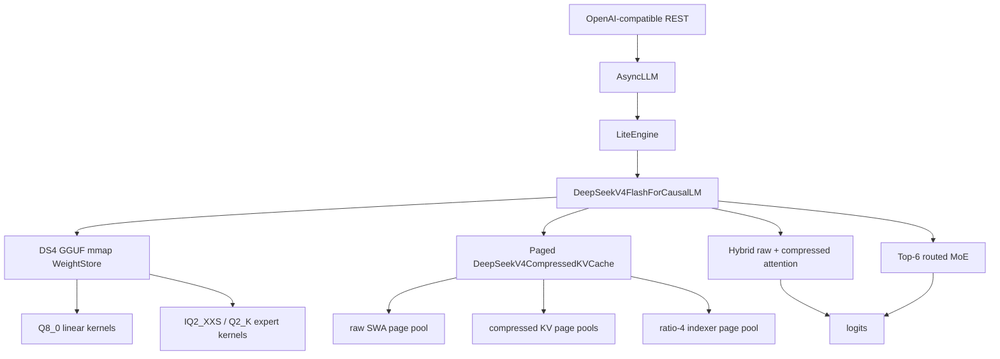

# DeepSeek V4 Flash Q2 Native Support Design

Date: 2026-06-03

## Scope

FastInference will add experimental native support for
`DeepSeek-V4-Flash-IQ2XXS-w2Q2K-AProjQ8-SExpQ8-OutQ8-chat-v2-imatrix.gguf`.

This target follows the DS4 `q2-imatrix` model distributed from
`antirez/deepseek-v4-gguf`. An earlier draft named
`DeepSeek-V4-Flash-Spark-Q2-REAP-ds4.gguf`, but that exact file was not present
in the public repositories checked during bring-up. The Spark Q3 dynamic GGUF
and ModelScope Q2_K shard set are adjacent artifacts, not this first native
target.

This is not a bridge to an external runtime. FastInference will own model
loading, quantized kernels, compressed KV state, model execution, and REST
serving through the existing lite runtime.

The first release target is intentionally narrow:

- `batch=1`
- `context=4096` and `context=8192`
- greedy decode
- OpenAI-compatible REST callable through `POST /v1/chat/completions`
- no hard throughput target

Out of scope for the first release:

- DeepSeek V4 Pro
- arbitrary DeepSeek GGUF files
- generic GGUF model support
- 1M-token context
- speculative decoding
- distributed execution
- external DS4 server integration
- non-greedy sampling guarantees beyond the existing sampling path

Primary references:

- <https://github.com/antirez/ds4>
- <https://huggingface.co/antirez/deepseek-v4-gguf>
- <https://huggingface.co/docs/transformers/v5.8.0/en/model_doc/deepseek_v4>

## Implemented State As Of End-To-End GPU Smoke Pass

The branch currently has an experimental batch=1 greedy GPU direct path for the
target GGUF. It is a correctness-first bring-up path, not a tuned production
serving path.

Current target file:

```text
models/DeepSeek-V4-Flash-ds4/DeepSeek-V4-Flash-IQ2XXS-w2Q2K-AProjQ8-SExpQ8-OutQ8-chat-v2-imatrix.gguf
```

Current target file size: `86,720,111,488` bytes, roughly 80.7GiB.

Implemented:

- GGUF parse and explicit DeepSeek V4 Flash adapter/loader routing for the
  target file.
- Semantic weight binding for the observed target GGUF tensor names, including
  token embedding, output norm, output projection, attention factor tensors,
  combined KV tensors, grouped/shared expert tensors, router tensors, and
  expert metadata tensors.
- Quant reference decoders and layout checks for `Q8_0`, `IQ2_XXS`, and `Q2_K`.
- Raw KV runtime cache append/read helpers plus paged compressed-KV layout and
  allocation contracts.
- Attention, mHC, compressor/indexer, routing, and grouped expert reference
  helpers used for isolated unit coverage.
- Full 43-layer GPU direct decode for batch=1 through real GGUF weights,
  returning finite `[1, vocab]` logits.
- Greedy GPU generation through `generate_greedy_kernel()`.
- LiteEngine direct runtime for the target DeepSeek model, with
  `AsyncLLM.generate()` and OpenAI-compatible REST using the same engine-facing
  boundary.
- GPU staging memory accounting and budget guardrails for decoded GGUF tensors.
- Explicit model execution boundaries:
  `forward_full_reference()` remains the CPU correctness oracle,
  `forward_full(..., use_kernel=True)` is an explicit future kernel dispatch
  point, and `kernel_execution_available` remains `False` until real kernels
  are wired.
- Initial GPU-facing scaffolding under
  `vllm/kernels/triton/deepseek_v4_flash/` for attention, cache updates, MoE,
  output projection, compressed attention contracts, and Q8 linear reference
  plumbing.

Not implemented:

- Production-speed Triton/ROCm kernels for every DeepSeek V4 Flash hot path.
- Continuous batching for DeepSeek V4 Flash.
- 4K/8K prompt prefill validation.

The GPU direct path still uses correctness-first PyTorch/Triton wrapper
fallbacks for some operators. It should be treated as an experimental
bring-up path until 4K/8K quality and performance validation are complete.

### Phase 0/1/2 Performance Notes

The first performance pass added DeepSeek-local profiling, staging cache
hit/miss accounting, warm serving preparation, output Q8 chunk caching, chunked
greedy token-id selection, and staging-budget streaming fallback for decoded
weights that do not fit in the resident cache.

Measured on the local Ryzen AI Max+ 395 / Radeon 8060S UMA machine with:

```bash
uv run --no-sync python tests/tools/run_deepseek_v4_flash_gpu_smoke.py \
  --model models/DeepSeek-V4-Flash-ds4/DeepSeek-V4-Flash-IQ2XXS-w2Q2K-AProjQ8-SExpQ8-OutQ8-chat-v2-imatrix.gguf \
  --context-length 4096
```

| Command suffix | Result |
| :--- | :--- |
| `--max-tokens 1 --repeat 1 --profile-json /tmp/deepseek-v4-flash-cold-profile.json` | `runs[0].elapsed_ms=410319.65625`, `tokens_per_second=0.002437124287778987`, output token ids `[1, 32974]`. |
| `--max-tokens 1 --repeat 2 --profile-json /tmp/deepseek-v4-flash-warm-profile.json` | run 0: `409545.5 ms`, `0.002441731138542604 tok/s`; run 1: `640.6128540039062 ms`, `1.5610052057961084 tok/s`. Staging cache after the run: `dynamic_hits=1317`, `dynamic_misses=1149`, `grouped_hits=774`, `grouped_misses=774`, `staged_bytes=44611017052`. |
| `--max-tokens 8 --repeat 1 --profile-json /tmp/deepseek-v4-flash-max8-profile.json` | `runs[0].elapsed_ms=877174.5`, `tokens_per_second=0.009120192162448863`, output token ids `[1, 32974, 40359, 81258, 860, 860, 860, 860, 860]`. Staging cache ended nearly full: `staged_bytes=61311773020` of `max_staged_bytes=61312033792`. |

The warm same-process one-token path demonstrates that resident staging cache
hits can reduce a repeated request from roughly 409 seconds to roughly
641 milliseconds. The max-8 run also shows the remaining bottleneck: after the
cache approaches the configured UMA budget, long-tail experts and dynamic
matrices fall back to streaming transfers. This preserves correctness and
avoids OOM, but it is not yet interactive for multi-token decode.

During max-8 validation, resident caching first failed on a new grouped expert
and then on a new indexer matrix after the cache reached the 61.3GB staging
budget. The implementation now streams budget-overflow expert, matrix, vector,
and output chunks without adding them to resident cache counters.

Current bounded validation commands:

```bash
timeout 600 uv run --no-sync pytest tests/deepseek_v4_flash/test_model_forward_real_smoke.py tests/deepseek_v4_flash/test_model_smoke_no_weights.py tests/deepseek_v4_flash/test_model_loader_route.py -q
timeout 600 uv run --no-sync pytest tests/smoke/test_deepseek_v4_flash_http_smoke.py -q
timeout 1200 uv run --no-sync pytest tests/deepseek_v4_flash -q
RUN_DEEPSEEK_V4_FLASH_GPU_SMOKE=1 SKIP_A_TIER=1 bash tests/run_inference_correctness_regression.sh
```

The maintained helper `tests/run_deepseek_v4_flash_real_smoke.sh` runs the two
bounded smoke commands and intentionally stays outside the fast regression suite.

### Phase 3 Performance Notes

The Phase 3 implementation adds the next layer of performance plumbing without
claiming final kernel speed:

- `DeepSeekV4FlashGPUWeightStager` now uses deterministic LRU accounting,
  tracks `lru_evictions` and `streamed_bytes`, and supports pinned hot expert
  entries through `DeepSeekV4FlashHotExpertPolicy`.
- Grouped expert tensors can expose raw GGUF expert payload slices without first
  CPU-decoding the full matrix. The stager can cache those raw `uint8` payloads
  on CUDA and reuse them by cache key.
- Routed MoE now prefers the raw quantized expert backend path and falls back to
  decoded dense expert GEMM only when the raw path is unavailable.
- `DeepSeekV4FlashExpertPrefetchRequest` and
  `prefetch_grouped_experts()` provide async-prefetch scaffolding with injectable
  CUDA streams and prefetch hit/miss/failure counters.
- Greedy decode keeps generated-token carry on GPU by passing the scalar token
  tensor into the next decode step instead of calling `next_token_tensor.item()`.
- The real smoke tool now reports stable `phase3_metrics`, including
  `lru_evictions`, `streamed_bytes`, `prefetch_hits`, `prefetch_misses`,
  `prefetch_failures`, `quantized_expert_calls`, and `cpu_sync_points`.

Important limitation: the `Q2_K` and `IQ2_XXS` expert matvec functions are
currently GPU-facing correctness contracts, not final fused Triton kernels.
They accept CUDA raw payload tensors, but the fallback implementation copies
payload bytes to CPU, uses the reference GGUF decoder, moves the decoded matrix
back to CUDA, and then runs the matvec. This validates layout, routing, and
backend contracts, but it can be slower than the Phase 2 decoded-cache path for
some runs. Phase 4 must replace these fallbacks with real Triton dequant-matvec
kernels before claiming production-speed Q2/IQ2 execution.

Recorded Phase 3 real-smoke command:

```bash
timeout --foreground --kill-after=60s 2400s \
  uv run --no-sync python tests/tools/run_deepseek_v4_flash_gpu_smoke.py \
  --model models/DeepSeek-V4-Flash-ds4/DeepSeek-V4-Flash-IQ2XXS-w2Q2K-AProjQ8-SExpQ8-OutQ8-chat-v2-imatrix.gguf \
  --context-length 4096 \
  --max-tokens 1 \
  --repeat 1 \
  --profile-json /tmp/deepseek-v4-flash-phase3-smoke-profile.json
```

Result:

- `runs[0].elapsed_ms=424678.46875`
- `tokens_per_second=0.00235472262802351`
- output token ids `[1, 32974]`
- `phase3_metrics.quantized_expert_calls=258`
- `phase3_metrics.cpu_sync_points=0`
- `gpu_staging.staged_bytes=20465981788`
- `gpu_staging.streamed_bytes=0`

The `max_tokens=8` real smoke was not repeated in this pass because the Phase 3
Q2/IQ2 fallback decodes raw payloads through the CPU reference path per token.
At the one-token timing above, a max-8 run is expected to take close to an hour
until Phase 4 replaces the fallback with true fused Triton kernels.

### Phase 4 Performance Notes

Phase 4 replaces the Phase 3 CPU decode fallback for the observed
`columns==256` Q2/IQ2 expert matvec path:

- `Q2_K` raw expert payloads now have a real Triton dequant-matvec kernel for
  the supported block shape.
- `IQ2_XXS` raw expert payloads now have a real Triton dequant-matvec kernel
  for the supported block shape, backed by GPU lookup tensors derived from the
  GGUF reference tables.
- Routed experts use the Triton path by default. Unsupported shapes now fail
  explicitly instead of silently falling back to CPU reference decode.
- `use_triton=False` remains available for deterministic unit/reference tests.
- The current `deepseek_v4_iq2_xxs_gate_up()` helper launches two IQ2 matvec
  kernels for gate and up. It is a GPU dequant-matvec path, but not yet a
  single fused gate-up kernel.

Recorded Phase 4 one-token smoke command:

```bash
timeout --foreground --kill-after=60s 2400s \
  uv run --no-sync python tests/tools/run_deepseek_v4_flash_gpu_smoke.py \
  --model models/DeepSeek-V4-Flash-ds4/DeepSeek-V4-Flash-IQ2XXS-w2Q2K-AProjQ8-SExpQ8-OutQ8-chat-v2-imatrix.gguf \
  --context-length 4096 \
  --max-tokens 1 \
  --repeat 1 \
  --profile-json /tmp/deepseek-v4-flash-phase4-smoke-profile.json
```

Result:

- `runs[0].elapsed_ms=404740.25`
- `tokens_per_second=0.0024707204188365254`
- output token ids `[1, 32974]`
- `phase4_metrics.iq2_xxs_triton_calls=516`
- `phase4_metrics.q2_k_triton_calls=0`
- `phase4_metrics.q2_iq2_reference_fallback_calls=0`
- `gpu_backend.quantized_expert_calls=258`
- `gpu_staging.loaded_bytes=46437112156`
- `gpu_staging.lru_evictions=0`
- first `output_projection` event was roughly `40062 ms`
- `generate_greedy_kernel` elapsed roughly `404719 ms`

Recorded Phase 4 max-8 smoke command:

```bash
timeout --foreground --kill-after=60s 7200s \
  uv run --no-sync python tests/tools/run_deepseek_v4_flash_gpu_smoke.py \
  --model models/DeepSeek-V4-Flash-ds4/DeepSeek-V4-Flash-IQ2XXS-w2Q2K-AProjQ8-SExpQ8-OutQ8-chat-v2-imatrix.gguf \
  --context-length 4096 \
  --max-tokens 8 \
  --repeat 1 \
  --profile-json /tmp/deepseek-v4-flash-phase4-max8-profile.json
```

Result:

- `runs[0].elapsed_ms=670454.0`
- `tokens_per_second=0.011932213097393706`
- output token ids `[1, 32974, 40359, 81258, 860, 860, 860, 860, 860]`
- `phase4_metrics.iq2_xxs_triton_calls=4128`
- `phase4_metrics.q2_k_triton_calls=0`
- `phase4_metrics.q2_iq2_reference_fallback_calls=0`
- `gpu_backend.quantized_expert_calls=2064`
- `gpu_staging.loaded_bytes=137982077276`
- `gpu_staging.lru_evictions=4271`
- `gpu_staging.staged_bytes=61303908700`
- `gpu_staging.max_staged_bytes=61312033792`
- `generate_greedy_kernel` elapsed roughly `670429 ms`

The target GGUF real-smoke path exercised IQ2 expert matvec calls and no
reference fallback calls. `Q2_K` is covered by synthetic kernel correctness
tests, but the recorded target smoke did not route through a `Q2_K` expert
matvec path.

Phase 4 removes the largest correctness-only CPU quantization fallback, but the
path is still not production speed. Remaining hot spots are now more explicit:

- Cold one-token execution still spends minutes staging roughly 46GB of decoded
  or raw payload state.
- Max-8 decode reaches the 61.3GB staging budget and triggers thousands of LRU
  evictions, loading roughly 138GB cumulatively for one request.
- The first output projection still costs tens of seconds; later output
  projection events are roughly 90ms after chunk caches are warm.
- Early layer events are dominated by staging, JIT, and cache warming; warm
  per-layer events become much smaller after resident state is available.
- Next performance work should prioritize hot-expert pinning, useful
  cross-layer prefetch, lower-churn LRU admission, output projection
  optimization, and a true single-launch gate/up fused kernel.

### Usable Inference Optimization Pass Notes

The usable-inference pass after Phase 4 added several performance facilities:

- Cache admission policy for stream-only grouped experts, so low-reuse entries
  can avoid polluting the resident cache.
- Bounded hot expert warmup via `prepare_deepseek_hot_experts()`.
- Next-layer expert prefetch scheduling for predictable hash-routed integer
  token steps.
- Cached expert-token routing tables and explicit
  `routed_expert_id_materializations` accounting for the remaining bounded
  top-k CPU materialization.
- Greedy output path support for returning `(token, value)` per output chunk,
  avoiding full chunk logits materialization when the backend provides
  `output_argmax_with_value()`.
- A single-launch IQ2 gate/up/SILU prototype for `columns==256`, with
  `iq2_xxs_gate_up_fused_calls` exposed in backend stats.
- Smoke-tool `usable_inference_metrics` covering pinned entries, stream bytes,
  prefetch counters, routed expert id materialization, fused IQ2 calls, and
  Q2/IQ2 fallback calls.

Recorded usable-pass one-token smoke command:

```bash
timeout --foreground --kill-after=60s 2400s \
  uv run --no-sync python tests/tools/run_deepseek_v4_flash_gpu_smoke.py \
  --model models/DeepSeek-V4-Flash-ds4/DeepSeek-V4-Flash-IQ2XXS-w2Q2K-AProjQ8-SExpQ8-OutQ8-chat-v2-imatrix.gguf \
  --context-length 4096 \
  --max-tokens 1 \
  --repeat 1 \
  --profile-json /tmp/deepseek-v4-flash-usable-one.json
```

Result:

- `runs[0].elapsed_ms=432429.125`
- `tokens_per_second=0.0023125176871469978`
- output token ids `[1, 32974]`
- `gpu_backend.quantized_expert_calls=258`
- `phase4_metrics.iq2_xxs_triton_calls=516`
- `phase4_metrics.iq2_xxs_gate_up_fused_calls=0`
- `phase4_metrics.q2_iq2_reference_fallback_calls=0`
- `gpu_staging.loaded_bytes=46446420316`
- `gpu_staging.prefetch_misses=36`
- `gpu_staging.prefetch_hits=0`
- `gpu_staging.routed_expert_id_materializations=43`
- `gpu_staging.lru_evictions=0`
- `usable_inference_metrics.streamed_bytes=0`
- `output_projection` event was roughly `44767 ms`
- `generate_greedy_kernel` elapsed roughly `432423 ms`

This pass did not reach the local usability target. The one-token result is
slower than the recorded Phase 4 one-token run, and the fused IQ2 gate/up
prototype did not execute on the target GGUF path. The likely reason is that
the observed real expert shapes do not match the prototype's current
`columns==256` dispatch condition, so backend execution still reports the same
516 IQ2 matvec calls as Phase 4.

The next required performance work is therefore narrower than the original
usable pass:

- Inspect real routed expert payload shapes from the target GGUF and extend the
  fused IQ2 gate/up activation kernel to the actual hidden/intermediate shape.
- Make prefetch useful for tensor-token continuation without introducing a
  device-to-host token sync, or keep a small GPU-resident routing prediction
  cache.
- Reduce the first output projection cost beyond the Python-level
  `(token, value)` interface; the current helper still computes projection
  through the existing PyTorch path inside each chunk.
- Apply a real hot-expert policy before smoke runs so `pinned_entries` is
  non-zero and repeated decode avoids long-tail cache churn.
- Re-run max-8 only after one-token cold path improves, because the current
  one-token timing predicts another very long max-8 run.

### Real Expert Shape Fused Path Notes

The follow-up fused-path pass first inspected the target GGUF grouped expert
metadata without decoding weights. The observed routed expert shapes are:

| Projection | GGML type | Rows | Columns | Column blocks |
| :--- | :--- | ---: | ---: | ---: |
| gate | `IQ2_XXS` (`16`) | `2048` | `4096` | `16` |
| up | `IQ2_XXS` (`16`) | `2048` | `4096` | `16` |
| down | `Q2_K` (`10`) | `4096` | `2048` | `8` |

This confirmed why the original fused gate/up prototype did not execute: it
only accepted `columns==256`, while real gate/up tensors use sixteen 256-column
GGUF blocks per row.

The fused IQ2 gate/up activation helper now supports `columns == 256 * N` and
the backend dispatch accepts matching IQ2 gate/up payloads when
`columns % 256 == 0`.

Recorded real-shape fused one-token smoke command:

```bash
timeout --foreground --kill-after=60s 2400s \
  uv run --no-sync python tests/tools/run_deepseek_v4_flash_gpu_smoke.py \
  --model models/DeepSeek-V4-Flash-ds4/DeepSeek-V4-Flash-IQ2XXS-w2Q2K-AProjQ8-SExpQ8-OutQ8-chat-v2-imatrix.gguf \
  --context-length 4096 \
  --max-tokens 1 \
  --repeat 1 \
  --profile-json /tmp/deepseek-v4-flash-real-fused-one.json
```

Result:

- `runs[0].elapsed_ms=433336.40625`
- `tokens_per_second=0.0023076759431633837`
- output token ids `[1, 32974]`
- `gpu_backend.quantized_expert_calls=258`
- `phase4_metrics.iq2_xxs_gate_up_fused_calls=258`
- `phase4_metrics.iq2_xxs_triton_calls=0`
- `phase4_metrics.q2_k_triton_calls=258`
- `phase4_metrics.q2_iq2_reference_fallback_calls=0`
- `gpu_staging.loaded_bytes=46446420316`
- `gpu_staging.prefetch_hits=0`
- `gpu_staging.prefetch_misses=36`
- `gpu_staging.routed_expert_id_materializations=43`
- `output_projection` event was roughly `43936 ms`
- `generate_greedy_kernel` elapsed roughly `433223 ms`

The primary gate for this pass was met: the real GGUF path now hits fused IQ2
gate/up for every routed expert call, and the previous 516 separate IQ2
gate/up matvec calls disappear. Throughput did not improve because the cold
path remains dominated by staging, Q2_K down projection, per-layer overhead,
and output projection. The next narrow kernel target should be the real down
projection shape: `Q2_K rows=4096, columns=2048`.

### Real Q2_K Down Multi-Block Notes

The follow-up down-projection pass extended the `Q2_K` Triton matvec path from
single-block rows to `columns == 256 * N`. This matches the routed expert down
projection payloads observed in the target GGUF file:
`Q2_K rows=4096, columns=2048, column_blocks=8`.

Recorded real Q2 down one-token smoke command:

```bash
timeout --foreground --kill-after=60s 2400s \
  uv run --no-sync python tests/tools/run_deepseek_v4_flash_gpu_smoke.py \
  --model models/DeepSeek-V4-Flash-ds4/DeepSeek-V4-Flash-IQ2XXS-w2Q2K-AProjQ8-SExpQ8-OutQ8-chat-v2-imatrix.gguf \
  --context-length 4096 \
  --max-tokens 1 \
  --repeat 1 \
  --profile-json /tmp/deepseek-v4-flash-q2-down-one.json
```

Result:

- output token ids `[1, 32974]`
- `gpu_backend.quantized_expert_calls=258`
- `phase4_metrics.iq2_xxs_gate_up_fused_calls=258`
- `phase4_metrics.iq2_xxs_triton_calls=0`
- `phase4_metrics.q2_k_triton_calls=258`
- `phase4_metrics.q2_iq2_reference_fallback_calls=0`
- `gpu_staging.loaded_bytes=20475289948`
- `gpu_staging.staged_bytes=20475289948`
- `gpu_staging.grouped_entries=774`
- `gpu_staging.prefetch_hits=0`
- `gpu_staging.prefetch_misses=36`
- `gpu_staging.routed_expert_id_materializations=43`
- `output_projection` event was roughly `49693 ms`
- `generate_greedy_kernel` elapsed roughly `357631 ms`

This pass met the narrow kernel target: real GGUF gate/up and down expert
payloads now all enter Triton-backed quantized expert paths with zero
`q2_iq2_reference_fallback_calls`. The profile improved from roughly
`433223 ms` to `357631 ms` for the same one-token cold smoke, and staged bytes
dropped from roughly `46.4 GB` to `20.5 GB`. The path is still not usable for
interactive serving. The next bottlenecks are the full-vocab output projection
at roughly `50 s`, remaining per-layer overhead, and the fact that expert
prefetch still records zero hits on the cold smoke.

### Output Projection Q8_0 Optimization Notes

The next output-focused pass replaced the PyTorch Q8_0 output projection chunk
path with a Triton dequant-matvec helper and split greedy output into two
steps:

- collapse output hyper-connection streams and output RMS norm once per token;
- run Q8_0 chunk logits/argmax from the collapsed hidden state.

The retained chunk size was also increased from `1024` vocab rows to `8192`
rows. The target GGUF has roughly 129k vocab rows, so this reduces output
projection chunks from roughly 127 to roughly 16 per generated token.

Recorded one-token smoke command:

```bash
timeout --foreground --kill-after=60s 2400s \
  uv run --no-sync python tests/tools/run_deepseek_v4_flash_gpu_smoke.py \
  --model models/DeepSeek-V4-Flash-ds4/DeepSeek-V4-Flash-IQ2XXS-w2Q2K-AProjQ8-SExpQ8-OutQ8-chat-v2-imatrix.gguf \
  --context-length 4096 \
  --max-tokens 1 \
  --repeat 1 \
  --profile-json /tmp/deepseek-v4-flash-output-chunk8192-one.json
```

Result:

- output token ids `[1, 32974]`
- `phase4_metrics.iq2_xxs_gate_up_fused_calls=258`
- `phase4_metrics.q2_k_triton_calls=258`
- `phase4_metrics.q2_iq2_reference_fallback_calls=0`
- `output_projection` event was roughly `36000 ms`
- `generate_greedy_kernel` elapsed roughly `330093 ms`

The single-row Q8_0 Triton matvec plus larger output chunks is the retained
path. A 16-row tiled Q8_0 prototype was measured and rejected because it raised
`output_projection` to roughly `68489 ms` on the target ROCm machine. The next
output-specific step should be a better reduction kernel that fuses Q8_0
matvec and per-chunk argmax, instead of materializing chunk logits and calling
`torch.max` for every output chunk.

Task 8 validation results recorded from the bounded run:

- `timeout 600 uv run --no-sync pytest tests/deepseek_v4_flash/test_model_forward_real_smoke.py tests/deepseek_v4_flash/test_model_smoke_no_weights.py tests/deepseek_v4_flash/test_model_loader_route.py -q`
  reported `11 passed`.
- `timeout 600 uv run --no-sync pytest tests/smoke/test_deepseek_v4_flash_http_smoke.py -q`
  reported `2 passed`.
- `timeout 1200 uv run --no-sync pytest tests/deepseek_v4_flash -q`
  reported `106 passed`.
- `tests/run_deepseek_v4_flash_real_smoke.sh` reported `11 passed`, then
  `2 passed`.

GPU migration boundary validation recorded after removing the direct-reference
REST/AsyncLLM production hooks:

- `timeout 120s uv run --no-sync pytest tests/smoke/test_deepseek_v4_flash_http_smoke.py -q`
  reported `4 passed`.
- `timeout 120s uv run --no-sync pytest tests/deepseek_v4_flash/test_async_llm_direct_reference.py -q`
  reported `4 passed`.
- `timeout 120s uv run --no-sync pytest tests/test_engine_executor_contracts.py -q`
  reported `3 passed`.
- `timeout 180s uv run --no-sync pytest tests/deepseek_v4_flash/test_block_reference.py tests/deepseek_v4_flash/test_model_dispatch_boundary.py -q`
  reported `10 passed`.
- `timeout 120s uv run --no-sync pytest tests/deepseek_v4_flash/test_kernel_scaffolding.py tests/deepseek_v4_flash/test_model_dispatch_boundary.py -q`
  reported `5 passed`.
- `bash tests/run_regression_suite.sh` reported
  `123 passed, 2 skipped`.
- `bash tests/run_inference_correctness_regression.sh` completed all requested
  correctness regression stages successfully, including TinyLlama, Qwen3.5-9B
  AWQ, Gemma4-31B, and Gemma4-26B checks.

## Current Project Fit

The existing lite architecture has the right high-level extension points:

- `vllm/adapters/` owns model capability and runtime policy.
- `vllm/model_executor/models/registry.py` owns model class resolution.
- `vllm/model_executor/models/` owns model implementations.
- `vllm/kernels/triton/` owns custom kernels.
- `vllm/engine/` should remain model-family agnostic.
- `vllm/entrypoints/openai/api_server.py` already serves the lite engine over
  OpenAI-compatible chat REST.

The current PagedAttention path is not a fit for DeepSeek V4 Flash. DeepSeek V4
uses raw sliding-window attention plus compressed attention rows and, in ratio-4
layers, an indexer that selects visible compressed rows. The DeepSeek V4 Flash
model must therefore own a separate compressed KV implementation instead of
pretending to be a standard paged-KV model.

However, DeepSeek V4 Flash must preserve the most important engineering
property of PagedAttention: logical KV growth must not require one large
contiguous full-context allocation. The DeepSeek path uses a different
attention algorithm, but it must keep page/block-based memory ownership.
Raw SWA rows, compressed attention rows, and ratio-4 indexer rows are stored in
paged chunk pools with explicit page tables.

## Proposed Modules

```text
vllm/adapters/deepseek_v4_flash.py
vllm/model_executor/models/deepseek_v4_flash/
  __init__.py
  config.py
  gguf_reader.py
  weight_store.py
  quant.py
  compressed_kv.py
  attention.py
  moe.py
  model.py
vllm/kernels/triton/deepseek_v4_flash/
  attention.py
  cache.py
  moe.py
  output.py
  q8_linear.py
  iq2_xxs.py
  q2_k.py
  routed_moe.py
  compressed_attention.py
```

The model package should stay vertical and explicit, but not monolithic.
`model.py` wires layers together and owns the reference/kernel dispatch
boundary. Format parsing, quantized math, attention, and MoE execution stay in
separate modules so they can be tested independently. The OpenAI API server,
`AsyncLLM`, `LiteEngine`, and prefill/decode executors remain control-plane
code and must not grow DeepSeek-specific math.

## Data Flow



## GGUF Reader

`gguf_reader.py` will implement a strict GGUF v3 reader for this model family.
It should mmap the model file, parse metadata and tensor directory entries, and
return typed tensor descriptors with absolute file offsets.

The reader must validate:

- architecture metadata uses DeepSeek V4 keys
- 43 transformer layers for Flash
- hidden size 4096
- vocabulary size 129280
- 64 attention heads
- 1 KV head
- head dimension 512
- raw sliding-window size 128
- 256 routed experts
- top-6 routed experts
- supported tensor types only: `Q8_0`, `IQ2_XXS`, `Q2_K`, plus any required
  plain metadata or scalar tensors present in the target file

The reader must reject unknown model variants by default. New GGUF files can be
allowed only by adding an explicit profile and tests.

## Weight Store

`weight_store.py` will convert GGUF tensor names into semantic layer weight
tables. Runtime code should access fields such as `layer.attn_q_a` or
`layer.ffn_gate_exps`, not string-search the GGUF directory during forward.

The first implementation should use:

- process mmap as the authoritative backing store
- GPU/shared-memory staging for hot tensor ranges
- optional Q8 dequant cache for attention/shared/output projections
- routed expert cache keyed by `(layer, expert_id, projection)`

The routed expert cache is part of correctness and reliability, not only
performance. It must be bounded by configuration and expose hit, miss, loaded
byte, and eviction counters. Cache misses load the selected expert slice from
mmap backing and feed the relevant Triton kernel. Eviction must be deferred for
all experts participating in the current forward pass so one decode step cannot
evict an expert it still needs later in the same step. This is expert staging,
not a general disk paging system.

The first implementation should keep the policy simple:

- dynamic LRU budget with an explicit byte cap
- no automatic top-K expert pinning until real routing statistics are available
- an extension point for manually pinned `(layer, expert_id)` entries
- async prefetch scaffolding that can be driven by explicit expert-id requests

Static-dynamic caching and automatic next-layer double-buffered prefetch remain
follow-up optimizations. They should be enabled only after the inspect and smoke
paths can report stable expert hit/miss behavior for the target GGUF.

## Quantized Kernels

The first native path needs these kernel families:

- `Q8_0` linear for attention projections, shared experts, output projections,
  and output head.
- `IQ2_XXS` dot/dequant for routed gate/up experts.
- `Q2_K` dot/dequant for routed down experts.
- routed MoE decode for `batch=1`, top-6 experts.

Initial kernels can prioritize correctness and memory safety over peak
throughput. Each kernel must include a PyTorch reference test and edge cases for
empty, tiny, and shape-boundary inputs. Every Triton file must follow the
project rule of documenting memory layout and program tiling in ASCII comments.

Before binding real `IQ2_XXS` and `Q2_K` kernels, the loader must provide a
quantization layout audit for the target GGUF:

- tensor type counts
- representative tensor names, shapes, and offsets for each quant type
- offset alignment information
- raw block layout notes derived from the real file, not assumed from adjacent
  GGUF variants

The first kernel path may read the raw GGUF layout directly if that is the
fastest route to correctness. GPU-friendly transposition/repacking is a
profile-driven optimization: add it only when raw-layout dequant is measured to
be the bottleneck on the target ROCm machine.

## Compressed KV And Attention

`compressed_kv.py` owns the DeepSeek V4 KV layout:

- raw sliding-window cache for the most recent 128 tokens
- layer 0 and layer 1 use raw attention only
- even layers from layer 2 onward use ratio-4 compressed attention with indexer
  state
- odd layers from layer 3 onward use ratio-128 compressed attention
- compressed rows store attention/value-width data
- ratio-4 layers also store indexer KV rows

The KV layout must be paged:

- it must not allocate one contiguous `[layer, context, width]` full-context
  tensor
- raw SWA rows use a small raw page pool
- ratio-4 compressed rows use a compressed page pool
- ratio-128 compressed rows use a compressed page pool
- ratio-4 indexer rows use a separate indexer page pool because the row width
  differs from attention compressed rows
- logical row ids are resolved through page tables into `(chunk_id, page_id,
  row_offset)` physical addresses

The first implementation should allocate medium-sized chunks and grow on
demand. This keeps the PagedAttention memory advantage without forcing
DeepSeek V4 to use the PagedAttention algorithm. A suitable first shape is:

- raw page: 16 raw rows
- compressed page: 64 compressed rows
- indexer page: 64 indexer rows
- chunk: 64 pages

The compressed attention kernel contract should consume page tables, not a
single contiguous compressed cache:

```text
raw_page_table
raw_page_chunks
compressed_page_table
compressed_page_chunks
indexer_page_table
indexer_page_chunks
selected_compressed_row_ids
```

The first implementation should support contexts 4096 and 8192. It should not
allocate for 1M tokens. Context expansion must go through explicit profiling and
memory estimation changes.

The attention implementation should be isolated from the existing
PagedAttention kernels. It may reuse shared utility code, but it must expose a
separate model-local contract so standard paged-KV models are unaffected.

Co-allocating ratio-4 compressed rows and ratio-4 indexer rows can reduce one
page-table lookup, but it is not a first-release requirement. The row widths are
different, so co-allocation may trade pointer chasing for padding waste and
allocator complexity. Keep separate pools initially; merge them only if
profiling shows page-table overhead matters more than memory slack.

## Model Adapter

`DeepSeekV4FlashAdapter` will identify the model from GGUF metadata and return a
strict experimental policy:

- `model_type="deepseek_v4_flash"`
- `supports_moe=True`
- `supports_fp8_kv=False`
- `supports_int4_kv=False`
- `supports_paged_prefill=False`
- `preferred_kv_dtype="deepseek_v4_compressed"`
- max tested context initially capped at 8192

The adapter should make unsafe defaults explicit. If the user requests a larger
context before that size is validated, config construction should fail with a
clear message instead of silently over-allocating UMA memory.

## Engine Integration

The lite engine should remain generic. The model implementation will own its
DeepSeek-specific compressed KV state and attention metadata. Engine changes
should be limited to:

- registering the new model architecture
- allowing a model-declared non-paged KV mode
- reporting DeepSeek V4 runtime memory stats through the existing observer
- preserving existing OpenAI REST request flow

No DeepSeek-specific branches should be added to `LiteEngine`,
`StepScheduler`, or `RequestScheduler`.

## Memory Policy

The target machine has ROCm UMA with roughly 61GB GPU-addressable shared memory.
The target GGUF file is `86,720,111,488` bytes, roughly 80.7GiB. Therefore the
file size must not be treated as fully resident GPU memory. The process mmap is
the authoritative backing store, while the runtime budget tracks resident
weights, KV, scratch, and expert cache separately. The design must treat memory
as tight and fail before allocation-heavy load when the resident estimate leaves
less than the required system headroom.

Required safeguards:

- inspect-only mode before any allocation-heavy load
- startup memory estimate for weights, KV, scratch, and expert cache
- separate reporting for `model_mmap_bytes` and resident runtime bytes
- hard cap on context length for the first release
- hard cap on expert cache size
- maximum single KV allocation size for each page-pool chunk
- tests that reject accidental full-context contiguous KV allocation
- fail-fast if estimated resident memory leaves insufficient UMA headroom
- runtime counters for expert cache hits, misses, loaded bytes, and evictions

The first release should prefer fitting reliably over aggressive caching.

Startup warmup should be limited to shapes that are actually part of the first
release: short decode, 4K context, and 8K context. Do not compile every expert
or every power-of-two sequence length before opening the REST port. Decode
hot-path kernels should target no more than roughly 64 registers per thread on
AMD, but exceeding that target is allowed only with a documented reason and a
lower-ILP fallback or benchmark evidence.

## Validation

Phase gates:

1. Inspect-only:
   - parse target GGUF
   - print model shape
   - print tensor type counts
   - print tensor offset alignment issues
   - estimate memory for 4K and 8K contexts
   - distinguish mmap file bytes from resident runtime bytes

2. Quant reference:
   - validate `Q8_0`, `IQ2_XXS`, and `Q2_K` reference decode against known
     tensor slices

3. Triton quant:
   - compare each Triton kernel against the PyTorch reference
   - benchmark raw GGUF layout before adding any transposed cache

4. Compressed KV:
   - validate raw SWA and compressed row accounting for 4K and 8K contexts
   - validate page-table mapping for raw, compressed, and indexer rows
   - validate no single KV allocation scales as full context by full row width

5. Model smoke:
   - load target GGUF
   - run greedy decode for fixed prompts
   - verify output is non-empty, terminates, and does not produce repetitive
     obvious corruption

6. REST smoke:
   - start `vllm.entrypoints.openai.api_server`
   - call `POST /v1/chat/completions`
   - verify non-streaming response
   - verify streaming response

7. Memory stability:
   - run repeated 4K and 8K requests
   - verify resident memory and cache counters stabilize after warm cache

8. Graceful degradation:
   - reject out-of-bounds context requests with a clear REST error
   - keep the engine process online after the rejected request

The first release does not require `run_inference_correctness_regression.sh` to
include DeepSeek V4 Flash. Once smoke is stable, a dedicated DeepSeek V4 Flash
correctness entry can be added.

## Risks

- The DS4 GGUF layout is specialized and may change. The reader must reject
  unknown layouts instead of accepting them optimistically.
- Q2 kernels are new to this project and can easily produce plausible but wrong
  text. Reference tests are mandatory before model-level smoke tests.
- Compressed attention is the largest correctness risk. It should be tested
  independently from MoE kernels.
- UMA memory pressure can stall the machine. Inspect-only mode and conservative
  memory caps are required.
- Throughput may be poor in the first release. The acceptance target is
  functional native support, not performance parity with DS4.

## Acceptance Criteria

The first native release is accepted when:

- the DS4 `q2-imatrix` GGUF is detected and rejected/accepted through explicit
  metadata validation.
- `batch=1` greedy decode runs at `context=4096`.
- `batch=1` greedy decode runs at `context=8192`.
- `POST /v1/chat/completions` returns a valid non-streaming response.
- `POST /v1/chat/completions` returns valid streaming chunks.
- startup memory estimation is printed or available in runtime stats.
- expert cache hit/miss counters are visible in runtime stats.
- existing smoke tests still pass.
