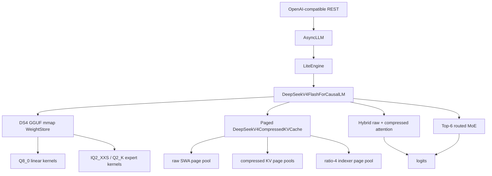

# DeepSeek V4 Flash Q2 Native Support Design

Date: 2026-06-03

## Scope

FastInference will add experimental native support for
`DeepSeek-V4-Flash-IQ2XXS-w2Q2K-AProjQ8-SExpQ8-OutQ8-chat-v2-imatrix.gguf`.

This target follows the DS4 `q2-imatrix` model distributed from
`antirez/deepseek-v4-gguf`. An earlier draft named
`DeepSeek-V4-Flash-Spark-Q2-REAP-ds4.gguf`, but that exact file was not present
in the public repositories checked during bring-up. The Spark Q3 dynamic GGUF
and ModelScope Q2_K shard set are adjacent artifacts, not this first native
target.

This is not a bridge to an external runtime. FastInference will own model
loading, quantized kernels, compressed KV state, model execution, and REST
serving through the existing lite runtime.

The first release target is intentionally narrow:

- `batch=1`
- `context=4096` and `context=8192`
- greedy decode
- OpenAI-compatible REST callable through `POST /v1/chat/completions`
- no hard throughput target

Out of scope for the first release:

- DeepSeek V4 Pro
- arbitrary DeepSeek GGUF files
- generic GGUF model support
- 1M-token context
- speculative decoding
- distributed execution
- external DS4 server integration
- non-greedy sampling guarantees beyond the existing sampling path

Primary references:

- <https://github.com/antirez/ds4>
- <https://huggingface.co/antirez/deepseek-v4-gguf>
- <https://huggingface.co/docs/transformers/v5.8.0/en/model_doc/deepseek_v4>

## Implemented State As Of Task 8

The branch currently has a limited, honest bring-up state. It does not yet meet
the first-release target described above.

Current target file:

```text
models/DeepSeek-V4-Flash-ds4/DeepSeek-V4-Flash-IQ2XXS-w2Q2K-AProjQ8-SExpQ8-OutQ8-chat-v2-imatrix.gguf
```

Current target file size: `86,720,111,488` bytes, roughly 80.7GiB.

Implemented:

- GGUF parse and explicit DeepSeek V4 Flash adapter/loader routing for the
  target file.
- Semantic weight binding for the observed target GGUF tensor names, including
  token embedding, output norm, output projection, attention factor tensors,
  combined KV tensors, grouped/shared expert tensors, router tensors, and
  expert metadata tensors.
- Quant reference decoders and layout checks for `Q8_0`, `IQ2_XXS`, and `Q2_K`.
- Raw KV runtime cache append/read helpers plus paged compressed-KV layout and
  allocation contracts.
- Attention and router reference helpers used for isolated unit coverage.
- Direct model forward smoke only for exactly one token: token embedding,
  `output_norm` RMSNorm, and `Q8_0` output projection to finite `[1, vocab]`
  logits. The model marks this with `limited_forward_smoke_only=True` and
  rejects multi-token non-empty input.
- OpenAI route exposure and a negative REST smoke that verifies an uninitialized
  app-import server returns HTTP 503 for chat requests.

Not implemented:

- Full transformer layer stack execution.
- Factorized Q/O attention execution.
- Combined KV tensor split and attention use.
- Compressed attention execution.
- Grouped expert execution.
- Batch=1 greedy autoregressive decode.
- Initialized OpenAI-compatible REST generation for this GGUF.

The REST route is present, but initialized DeepSeek GGUF chat generation remains
blocked because the OpenAI server uses `AsyncLLM`/`LiteEngine` full prefill and
decode execution. That path is separate from the limited one-token direct model
smoke.

Current bounded validation commands:

```bash
timeout 600 uv run --no-sync pytest tests/deepseek_v4_flash/test_model_forward_real_smoke.py tests/deepseek_v4_flash/test_model_smoke_no_weights.py tests/deepseek_v4_flash/test_model_loader_route.py -q
timeout 600 uv run --no-sync pytest tests/smoke/test_deepseek_v4_flash_http_smoke.py -q
timeout 1200 uv run --no-sync pytest tests/deepseek_v4_flash -q
```

The maintained helper `tests/run_deepseek_v4_flash_real_smoke.sh` runs the two
bounded smoke commands and intentionally stays outside the fast regression suite.

Task 8 validation results recorded from the bounded run:

- `timeout 600 uv run --no-sync pytest tests/deepseek_v4_flash/test_model_forward_real_smoke.py tests/deepseek_v4_flash/test_model_smoke_no_weights.py tests/deepseek_v4_flash/test_model_loader_route.py -q`
  reported `11 passed`.
- `timeout 600 uv run --no-sync pytest tests/smoke/test_deepseek_v4_flash_http_smoke.py -q`
  reported `2 passed`.
- `timeout 1200 uv run --no-sync pytest tests/deepseek_v4_flash -q`
  reported `106 passed`.
- `tests/run_deepseek_v4_flash_real_smoke.sh` reported `11 passed`, then
  `2 passed`.

## Current Project Fit

The existing lite architecture has the right high-level extension points:

- `vllm/adapters/` owns model capability and runtime policy.
- `vllm/model_executor/models/registry.py` owns model class resolution.
- `vllm/model_executor/models/` owns model implementations.
- `vllm/kernels/triton/` owns custom kernels.
- `vllm/engine/` should remain model-family agnostic.
- `vllm/entrypoints/openai/api_server.py` already serves the lite engine over
  OpenAI-compatible chat REST.

The current PagedAttention path is not a fit for DeepSeek V4 Flash. DeepSeek V4
uses raw sliding-window attention plus compressed attention rows and, in ratio-4
layers, an indexer that selects visible compressed rows. The DeepSeek V4 Flash
model must therefore own a separate compressed KV implementation instead of
pretending to be a standard paged-KV model.

However, DeepSeek V4 Flash must preserve the most important engineering
property of PagedAttention: logical KV growth must not require one large
contiguous full-context allocation. The DeepSeek path uses a different
attention algorithm, but it must keep page/block-based memory ownership.
Raw SWA rows, compressed attention rows, and ratio-4 indexer rows are stored in
paged chunk pools with explicit page tables.

## Proposed Modules

```text
vllm/adapters/deepseek_v4_flash.py
vllm/model_executor/models/deepseek_v4_flash/
  __init__.py
  config.py
  gguf_reader.py
  weight_store.py
  quant.py
  compressed_kv.py
  attention.py
  moe.py
  model.py
vllm/kernels/triton/deepseek_v4_flash/
  q8_linear.py
  iq2_xxs.py
  q2_k.py
  routed_moe.py
  compressed_attention.py
```

The model package should stay vertical and explicit, but not monolithic.
`model.py` wires layers together. Format parsing, quantized math, attention,
and MoE execution stay in separate modules so they can be tested independently.

## Data Flow



## GGUF Reader

`gguf_reader.py` will implement a strict GGUF v3 reader for this model family.
It should mmap the model file, parse metadata and tensor directory entries, and
return typed tensor descriptors with absolute file offsets.

The reader must validate:

- architecture metadata uses DeepSeek V4 keys
- 43 transformer layers for Flash
- hidden size 4096
- vocabulary size 129280
- 64 attention heads
- 1 KV head
- head dimension 512
- raw sliding-window size 128
- 256 routed experts
- top-6 routed experts
- supported tensor types only: `Q8_0`, `IQ2_XXS`, `Q2_K`, plus any required
  plain metadata or scalar tensors present in the target file

The reader must reject unknown model variants by default. New GGUF files can be
allowed only by adding an explicit profile and tests.

## Weight Store

`weight_store.py` will convert GGUF tensor names into semantic layer weight
tables. Runtime code should access fields such as `layer.attn_q_a` or
`layer.ffn_gate_exps`, not string-search the GGUF directory during forward.

The first implementation should use:

- process mmap as the authoritative backing store
- GPU/shared-memory staging for hot tensor ranges
- optional Q8 dequant cache for attention/shared/output projections
- routed expert cache keyed by `(layer, expert_id, projection)`

The routed expert cache is part of correctness and reliability, not only
performance. It must be bounded by configuration and expose hit, miss, loaded
byte, and eviction counters. Cache misses load the selected expert slice from
mmap backing and feed the relevant Triton kernel. Eviction must be deferred for
all experts participating in the current forward pass so one decode step cannot
evict an expert it still needs later in the same step. This is expert staging,
not a general disk paging system.

The first implementation should keep the policy simple:

- dynamic LRU budget with an explicit byte cap
- no automatic top-K expert pinning until real routing statistics are available
- an extension point for manually pinned `(layer, expert_id)` entries
- no asynchronous prefetch requirement in the first release

Static-dynamic caching and double-buffered prefetch are valid follow-up
optimizations. They should be enabled only after the inspect and smoke paths
can report stable expert hit/miss behavior for the target GGUF.

## Quantized Kernels

The first native path needs these kernel families:

- `Q8_0` linear for attention projections, shared experts, output projections,
  and output head.
- `IQ2_XXS` dot/dequant for routed gate/up experts.
- `Q2_K` dot/dequant for routed down experts.
- routed MoE decode for `batch=1`, top-6 experts.

Initial kernels can prioritize correctness and memory safety over peak
throughput. Each kernel must include a PyTorch reference test and edge cases for
empty, tiny, and shape-boundary inputs. Every Triton file must follow the
project rule of documenting memory layout and program tiling in ASCII comments.

Before binding real `IQ2_XXS` and `Q2_K` kernels, the loader must provide a
quantization layout audit for the target GGUF:

- tensor type counts
- representative tensor names, shapes, and offsets for each quant type
- offset alignment information
- raw block layout notes derived from the real file, not assumed from adjacent
  GGUF variants

The first kernel path may read the raw GGUF layout directly if that is the
fastest route to correctness. GPU-friendly transposition/repacking is a
profile-driven optimization: add it only when raw-layout dequant is measured to
be the bottleneck on the target ROCm machine.

## Compressed KV And Attention

`compressed_kv.py` owns the DeepSeek V4 KV layout:

- raw sliding-window cache for the most recent 128 tokens
- layer 0 and layer 1 use raw attention only
- even layers from layer 2 onward use ratio-4 compressed attention with indexer
  state
- odd layers from layer 3 onward use ratio-128 compressed attention
- compressed rows store attention/value-width data
- ratio-4 layers also store indexer KV rows

The KV layout must be paged:

- it must not allocate one contiguous `[layer, context, width]` full-context
  tensor
- raw SWA rows use a small raw page pool
- ratio-4 compressed rows use a compressed page pool
- ratio-128 compressed rows use a compressed page pool
- ratio-4 indexer rows use a separate indexer page pool because the row width
  differs from attention compressed rows
- logical row ids are resolved through page tables into `(chunk_id, page_id,
  row_offset)` physical addresses

The first implementation should allocate medium-sized chunks and grow on
demand. This keeps the PagedAttention memory advantage without forcing
DeepSeek V4 to use the PagedAttention algorithm. A suitable first shape is:

- raw page: 16 raw rows
- compressed page: 64 compressed rows
- indexer page: 64 indexer rows
- chunk: 64 pages

The compressed attention kernel contract should consume page tables, not a
single contiguous compressed cache:

```text
raw_page_table
raw_page_chunks
compressed_page_table
compressed_page_chunks
indexer_page_table
indexer_page_chunks
selected_compressed_row_ids
```

The first implementation should support contexts 4096 and 8192. It should not
allocate for 1M tokens. Context expansion must go through explicit profiling and
memory estimation changes.

The attention implementation should be isolated from the existing
PagedAttention kernels. It may reuse shared utility code, but it must expose a
separate model-local contract so standard paged-KV models are unaffected.

Co-allocating ratio-4 compressed rows and ratio-4 indexer rows can reduce one
page-table lookup, but it is not a first-release requirement. The row widths are
different, so co-allocation may trade pointer chasing for padding waste and
allocator complexity. Keep separate pools initially; merge them only if
profiling shows page-table overhead matters more than memory slack.

## Model Adapter

`DeepSeekV4FlashAdapter` will identify the model from GGUF metadata and return a
strict experimental policy:

- `model_type="deepseek_v4_flash"`
- `supports_moe=True`
- `supports_fp8_kv=False`
- `supports_int4_kv=False`
- `supports_paged_prefill=False`
- `preferred_kv_dtype="deepseek_v4_compressed"`
- max tested context initially capped at 8192

The adapter should make unsafe defaults explicit. If the user requests a larger
context before that size is validated, config construction should fail with a
clear message instead of silently over-allocating UMA memory.

## Engine Integration

The lite engine should remain generic. The model implementation will own its
DeepSeek-specific compressed KV state and attention metadata. Engine changes
should be limited to:

- registering the new model architecture
- allowing a model-declared non-paged KV mode
- reporting DeepSeek V4 runtime memory stats through the existing observer
- preserving existing OpenAI REST request flow

No DeepSeek-specific branches should be added to `LiteEngine`,
`StepScheduler`, or `RequestScheduler`.

## Memory Policy

The target machine has ROCm UMA with roughly 61GB GPU-addressable shared memory.
The target GGUF file is `86,720,111,488` bytes, roughly 80.7GiB. Therefore the
file size must not be treated as fully resident GPU memory. The process mmap is
the authoritative backing store, while the runtime budget tracks resident
weights, KV, scratch, and expert cache separately. The design must treat memory
as tight and fail before allocation-heavy load when the resident estimate leaves
less than the required system headroom.

Required safeguards:

- inspect-only mode before any allocation-heavy load
- startup memory estimate for weights, KV, scratch, and expert cache
- separate reporting for `model_mmap_bytes` and resident runtime bytes
- hard cap on context length for the first release
- hard cap on expert cache size
- maximum single KV allocation size for each page-pool chunk
- tests that reject accidental full-context contiguous KV allocation
- fail-fast if estimated resident memory leaves insufficient UMA headroom
- runtime counters for expert cache hits, misses, loaded bytes, and evictions

The first release should prefer fitting reliably over aggressive caching.

Startup warmup should be limited to shapes that are actually part of the first
release: short decode, 4K context, and 8K context. Do not compile every expert
or every power-of-two sequence length before opening the REST port. Decode
hot-path kernels should target no more than roughly 64 registers per thread on
AMD, but exceeding that target is allowed only with a documented reason and a
lower-ILP fallback or benchmark evidence.

## Validation

Phase gates:

1. Inspect-only:
   - parse target GGUF
   - print model shape
   - print tensor type counts
   - print tensor offset alignment issues
   - estimate memory for 4K and 8K contexts
   - distinguish mmap file bytes from resident runtime bytes

2. Quant reference:
   - validate `Q8_0`, `IQ2_XXS`, and `Q2_K` reference decode against known
     tensor slices

3. Triton quant:
   - compare each Triton kernel against the PyTorch reference
   - benchmark raw GGUF layout before adding any transposed cache

4. Compressed KV:
   - validate raw SWA and compressed row accounting for 4K and 8K contexts
   - validate page-table mapping for raw, compressed, and indexer rows
   - validate no single KV allocation scales as full context by full row width

5. Model smoke:
   - load target GGUF
   - run greedy decode for fixed prompts
   - verify output is non-empty, terminates, and does not produce repetitive
     obvious corruption

6. REST smoke:
   - start `vllm.entrypoints.openai.api_server`
   - call `POST /v1/chat/completions`
   - verify non-streaming response
   - verify streaming response

7. Memory stability:
   - run repeated 4K and 8K requests
   - verify resident memory and cache counters stabilize after warm cache

8. Graceful degradation:
   - reject out-of-bounds context requests with a clear REST error
   - keep the engine process online after the rejected request

The first release does not require `run_inference_correctness_regression.sh` to
include DeepSeek V4 Flash. Once smoke is stable, a dedicated DeepSeek V4 Flash
correctness entry can be added.

## Risks

- The DS4 GGUF layout is specialized and may change. The reader must reject
  unknown layouts instead of accepting them optimistically.
- Q2 kernels are new to this project and can easily produce plausible but wrong
  text. Reference tests are mandatory before model-level smoke tests.
- Compressed attention is the largest correctness risk. It should be tested
  independently from MoE kernels.
- UMA memory pressure can stall the machine. Inspect-only mode and conservative
  memory caps are required.
- Throughput may be poor in the first release. The acceptance target is
  functional native support, not performance parity with DS4.

## Acceptance Criteria

The first native release is accepted when:

- the DS4 `q2-imatrix` GGUF is detected and rejected/accepted through explicit
  metadata validation.
- `batch=1` greedy decode runs at `context=4096`.
- `batch=1` greedy decode runs at `context=8192`.
- `POST /v1/chat/completions` returns a valid non-streaming response.
- `POST /v1/chat/completions` returns valid streaming chunks.
- startup memory estimation is printed or available in runtime stats.
- expert cache hit/miss counters are visible in runtime stats.
- existing smoke tests still pass.
